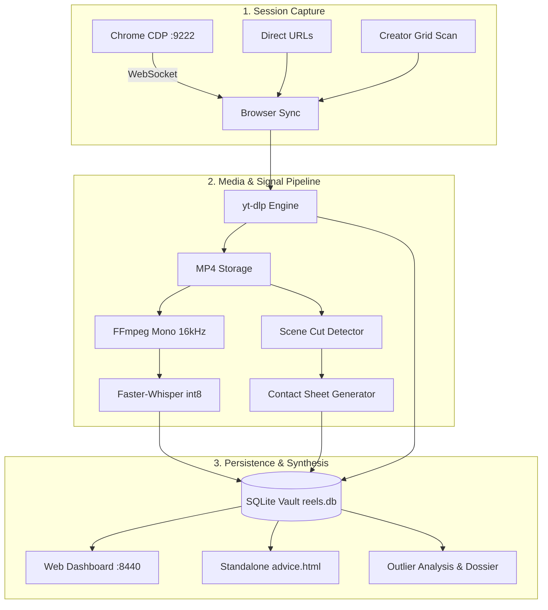

# Reel-Watcher

**Universal Short-Form Video Harvester, Scene Deconstructor, and Competitive Intelligence Engine.**

[](https://www.python.org/downloads/)
[](https://opensource.org/licenses/MIT)
[](https://github.com/psf/black)

Reel-Watcher is a local-first intelligence system designed to capture, deconstruct, transcribe, and reverse-engineer short-form videos (Instagram Reels, TikToks, YouTube Shorts). It turns viral videos, creator profiles, and saved feeds into actionable framework playbooks, copyable hook swipe files, and structured architecture blueprints.

---

## Key Features

- **Live Desktop Browser Harvester (CDP Bridge)**: Discovers and scrolls active Instagram sessions via Chrome DevTools Protocol (`port 9222`) over WebSockets. Bypasses CAPTCHAs, bot shields, and login walls using your real residential IP and cookies without storing credentials in code.
- **Creator Profiling & Outlier Multiplier Engine**: Calculates a creator's median view baseline and scores posts by outlier multiplier ($2\times$ to $50\times$). Isolates high-signal viral content and filters out normal baseline noise.
- **Zero-Cost Speech Transcription**: High-performance local speech-to-text using `faster-whisper` (`int8` quantization) and FFmpeg. Produces full word-level timestamps with zero external API fees.
- **Scene Detection & Visual Contact Sheets**: Splits videos at scene boundaries, extracts key visual frames, and compiles $3\times3$ diagnostic contact sheets.
- **Funnel & ManyChat Lead Magnet Extraction**: Detects call-to-actions, giveaway trigger keywords (e.g. *"Comment REDTEAM"*, *"Comment RISK"*), and bio links.
- **Interactive Dark-Mode Dashboard**: Local FastAPI web app (`http://localhost:8440`) featuring playable media, synchronized transcripts, score cards, and deep deconstruction modals.
- **Standalone Offline Playbook**: Generates a self-contained static HTML advice library (`advice.html`) for offline browsing and swipe file archiving.
- **Local SQLite Vault**: Stores metadata, transcripts, scores, and media paths locally with zero cloud dependencies.

---

## Architecture Overview



---

## Requirements

- **Python**: 3.11 or higher
- **FFmpeg & ffprobe**: Required for audio extraction and scene boundary splitting.
  - Windows: `winget install Gyan.FFmpeg` or `choco install ffmpeg`
  - macOS: `brew install ffmpeg`
  - Linux: `sudo apt install ffmpeg`
- **Package Manager**: [uv](https://github.com/astral-sh/uv) (recommended) or `pip`

---

## Installation

### 1. Clone the Repository
```bash
git clone https://github.com/officiallemmy254-droid/reel-watcher.git
cd reel-watcher
```

### 2. Set Up Environment (Using `uv`)
```bash
# Create virtual environment and install in editable mode
uv venv
uv pip install -e .
```

*Or with traditional pip:*
```bash
python -m venv .venv
source .venv/bin/activate  # On Windows: .venv\Scripts\activate
pip install -e .
```

### 3. Verify System Dependencies
Run the preflight health check to confirm FFmpeg, ffprobe, and Python bindings are operational:
```bash
reel-watcher preflight
# or via uv:
uv run reel-watcher preflight
```
`[+] All core media tools operational (ffmpeg, ffprobe).`

---

## Configuration

Copy the example environment file:
```bash
cp .env.example .env
```

```env
# Optional: Only needed for deep multi-modal Vision VLM analysis
OPENROUTER_API_KEY=
GEMINI_API_KEY=

# Local Vault Directories (defaults to ./vault)
REEL_WATCHER_VAULT_DIR=vault
REEL_WATCHER_DOWNLOADS_DIR=vault/downloads
REEL_WATCHER_DB_PATH=vault/reels.db

# Chrome Remote Debugging Endpoint
REEL_WATCHER_CDP_URL=http://127.0.0.1:9222
```

> **Note**: Core harvesting, media downloading, Faster-Whisper transcription, outlier filtering, and the web dashboard operate **100% locally with zero API keys required**.

---

## Activating Chrome CDP (Port 9222)

To harvest saved reels or scrape creator feeds without bot detection, launch Google Chrome with remote debugging enabled in an active desktop session.

### Windows
```cmd
chrome.exe --remote-debugging-port=9222 --user-data-dir="%LOCALAPPDATA%\Google\Chrome\User Data Debug" "https://www.instagram.com"
```

### macOS
```bash
/Applications/Google\ Chrome.app/Contents/MacOS/Google\ Chrome --remote-debugging-port=9222 --user-data-dir="$HOME/Library/Application Support/Google/Chrome Debug" "https://www.instagram.com"
```

### Linux
```bash
google-chrome --remote-debugging-port=9222 --user-data-dir="$HOME/.config/google-chrome-debug" "https://www.instagram.com"
```

Verify that the debugging endpoint is active:
```bash
curl http://127.0.0.1:9222/json
```

---

## CLI Command Reference

### 1. Harvest from Live Browser Session
Harvest saved reels directly from your currently open Instagram tab:
```bash
# Harvest active tab and enqueue into SQLite vault
reel-watcher harvest --collection software-and-app

# Full end-to-end sync (harvest + download + deconstruct)
reel-watcher sync-saved --collection all-posts --max-scrolls 5
```

### 2. Creator Outlier Intelligence
Scan any public creator profile, calculate engagement baselines, and isolate top viral outliers:
```bash
# 1. Scan creator grid and compute baseline median views
reel-watcher creator scan <handle> --limit 50

# 2. Harvest only posts exceeding 2.0x median views
reel-watcher creator harvest <handle> --min-multiplier 2.0 --top 5

# 3. Generate a comprehensive competitive intelligence dossier
reel-watcher creator dossier <handle>
```

### 3. Media Ingestion & Download
Download single reels or process the local vault queue:
```bash
# Download a single reel
reel-watcher download "https://www.instagram.com/reel/DeHYCIpColc/"

# Batch download pending queue items
reel-watcher download --pending --limit 10
```

### 4. Interactive Web Dashboard
Launch the dark-mode Playbook UI:
```bash
reel-watcher serve --port 8440
```
Open **`http://localhost:8440`** in your browser to view study cards, inspect full audio transcripts, watch video previews, and filter by tags.

### 5. Generate Offline HTML Advice Library
Compile your studied reels into a standalone, portable HTML file:
```bash
reel-watcher advice --out advice.html
```

### 6. Queue & Vault Querying
```bash
# List all analyzed studies
reel-watcher list

# List pending queue items
reel-watcher list --queue

# Search studies by keyword
reel-watcher list --query "security"
```

---

## Outlier Multiplier Explained

To bypass vanity metrics, Reel-Watcher computes:
$$\text{Baseline} = \text{median}(\text{views across scanned posts})$$
$$\text{Outlier Multiplier} = \frac{\text{Post Views}}{\text{Median Baseline}}$$

- **0.5x – 1.2x**: Baseline content (standard performance).
- **1.5x – 2.9x**: Strong outperformer.
- **3.0x – 15.0x+**: Viral breakout outlier (validated hook and problem framing).

---

## Running Tests

Reel-Watcher includes comprehensive test coverage for all modules:
```bash
pytest
# or via uv:
uv run pytest
```

---

## Security & Privacy Invariants

- **Local-First**: All database tables, downloaded videos, transcripts, and contact sheets remain on your local disk in `vault/`.
- **Zero Plaintext Credentials**: Authentication runs via active desktop browser sessions using local cookies; no passwords or session tokens are written to disk.
- **Airtight `.gitignore`**: Secret `.env` files, SQLite databases, and media downloads are strictly excluded from version control.

---

## License

This project is open-source under the [MIT License](LICENSE).
